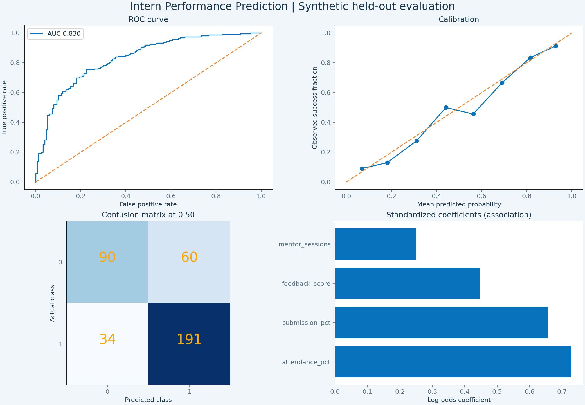

# 🌊 Ocean Analytics — Intern Performance Prediction

### Machine Learning · Mentor Guidance · Internee.pk

**Sajid Ali · Data Analyst Internship**

A mentor-support dashboard predicting end-of-program success from early attendance, task submissions, feedback and mentor interaction. Includes a genuine scikit-learn training pipeline and an offline browser predictor using the trained model's exported parameters.

## Open in seconds

1. Extract the entire ZIP.
2. Double-click **`index.html` in the main folder**. It opens the complete dashboard in `dist/index.html`. Alternatively, double-click `OPEN_DASHBOARD.bat` on Windows.
3. Filter the cohort, select an intern with **Review**, and move the prediction sliders. Probabilities and guidance update immediately.
4. Use **Model quality** to inspect held-out metrics and charts. No Python, internet, account or server is required to view the app.

## Live Project

- **Live Dashboard:** [Open the interactive dashboard](https://sajidexpertise.github.io/Intern-Performance-Prediction-Dashboard-Task-3-InterneePk/)
- **GitHub Repository:** [View source code](https://github.com/sajidexpertise/Intern-Performance-Prediction-Dashboard-Task-3-InterneePk)
- **Portfolio:** [sajidexpertise.vercel.app](https://sajidexpertise.vercel.app/)
- **LinkedIn:** [linkedin.com/in/sajidexpertise](https://www.linkedin.com/in/sajidexpertise)

> The live-dashboard link becomes active after GitHub Pages is enabled for this repository.

## Included analysis image



This is the actual Matplotlib evaluation output, not a screenshot of the interactive dashboard. Open `dist/index.html` for the dashboard itself. Browser screenshot capture was blocked in the preparation environment; no dashboard screenshot is claimed or included.

## Quick usage checklist

1. **Cohort overview:** choose a department or support group; cards, scatter, donut, department outlook, histogram, engagement profile and review table follow the selection. Hover chart points for details. Search by intern ID, or change the table ordering. Reset restores all 375 held-out interns.
2. **Prediction studio:** select Review on a table row, or open the tab directly. Move attendance, submissions, feedback and mentoring sliders; probability and guidance update immediately.
3. **Scenario comparison:** compare the current inputs with a hypothetical ten-percentage-point increase in attendance and submissions. Explore the attendance-sensitivity curve with your other inputs held fixed. These are model responses, not promised improvements.
4. **Exports:** Download filtered CSV saves the selected records; Download guidance saves a text action plan for the current scenario.
5. **Model quality:** view fixed test-set metrics and four evaluation charts. These deliberately do not follow cohort filters.
6. **Methodology:** read the data provenance, outcome timing and responsible-use limitations.

## Troubleshooting

| Issue | What to check |
|---|---|
| Dashboard is blank or cards do not populate | Extract all files; keep `index.html`, `style.css`, `app.js`, `bundle.js` and `model_evaluation.png` together in `dist`. Allow JavaScript in your browser. |
| Only a chart image opens | You opened `model_evaluation.png`. Open `dist/index.html` for interactive controls. |
| No interns appear | Clear the ID search and press Reset; a combined filter can legitimately match no records. |
| Python was not found | Python is optional for browsing. For retraining, use your installed Python's full path. |
| Node was not found | Node is needed only for the optional parity test, not for training or viewing the dashboard. |
| Edited CSV does not change the app | The app reads `bundle.js`. Update the training/data-loading workflow and regenerate the bundle; it does not read CSV live. |
| Phone cannot open local files | Keep all assets together; use a hosted version if the phone's file viewer does not run local HTML scripts. |

## Guideline mapping

| Requirement | Implementation |
|---|---|
| Attendance, submissions and feedback | `data/interns.csv` includes week-2 snapshots and the later simulated success label |
| Machine-learning success probability | StandardScaler + LogisticRegression, trained in scikit-learn; exported numeric parameters run in JavaScript |
| Personalized mentor guidance | Individual review, rule-based support suggestions, scenario comparison and downloadable guidance |

**Data caveat:** This is a synthetic portfolio benchmark, not collected official intern data. Confirm that synthetic data is permitted by the internship assessor. If actual collected data is mandatory, this dataset must be replaced and the model independently validated before submission. No guarantee of marks or acceptance is implied.

## Features

- Ocean Analytics design: white and ice-blue surfaces, ocean-blue charts, orange highlights and a high-contrast option
- Responsive layout with four navigation sections; no external fonts, chart services or internet connection needed
- Department, support-band and ID filters across all cohort cards, charts and records
- Held-out intern review queue, 50-record pagination and filtered CSV export
- Four live scenario sliders and success-probability estimation
- Personalized attendance, submission, feedback and mentoring suggestions
- Hypothetical engagement comparison (not a causal intervention forecast)
- Scatter plot, support donut, department lollipop bars, probability histogram and normalized engagement profile
- Attendance sensitivity curve, table sorting, empty-filter states and chart hover details
- ROC, calibration, confusion-matrix and standardized-coefficient charts
- Accuracy, precision, recall, F1, ROC AUC, Brier score and training-only cross-validation
- Prior-probability baseline; separate static evaluation so filtering cannot change reported model quality

## Data dictionary

| Field | Meaning |
|---|---|
| intern_id | Unique synthetic ID; not an input |
| attendance_pct | Percentage attendance during first two weeks, 0–100 |
| submission_pct | Percentage of tasks due by week 2 submitted, 0–100 |
| feedback_score | Mentor feedback at week 2, 1–5 |
| mentor_sessions | Total mentor contacts during weeks 1–2, 0–8 |
| department | Display/filter only; not a model input |
| final_success | Later simulated rubric outcome, 1 success / 0 otherwise |
| split | Training or held-out test partition |
| success_probability | Model estimate; training rows are in-sample and not evaluation evidence |

One row per intern. Fixed random seed 42. Synthetic engagement variables are correlated, and later labels are drawn from engagement-related probabilities with additional noise. No final outcome or post-program feedback is included in the input features.

## Model and evaluation

1,500 records are split once into 75% training / 25% test with stratification. Five-fold cross-validation runs on training data only. Scaling is fitted within the training pipeline, avoiding preprocessing leakage. The fixed LogisticRegression model uses C=1; there is no model selection on the test set. The exported model remains the train-only estimator, rather than being refitted on test records.

Classification metrics use a fixed 0.50 threshold and positive class success=1. Support bands are separate illustrative rules: priority below 0.40, check-in below 0.70, otherwise on track. They have not been optimized or validated as operational policies. The dashboard displays **only test interns** to avoid presenting training predictions as unseen performance.

Calibration is assessed with a reliability curve and Brier score; no separate calibration procedure or individual uncertainty interval is supplied. Synthetic benchmark performance is not evidence of real-world reliability. Associations do not establish causation; coefficients are not causal feature importance. Feedback can reflect mentor bias, and the model has not been audited for fairness on real demographic groups.

Before real deployment, obtain authorized data, define the final success rubric, validate on later cohorts and audit calibration, subgroup error rates and intervention outcomes. Use human review and supportive conversations only, never automatic rejection or disciplinary decisions.

## Reproduce training

Install Python and run from the project folder:

```bat
python -m pip install -r requirements.txt
python train.py
node tests/parity.cjs
```

If your Windows Python is at `C:\Python314\python.exe`, use that full quoted path instead of `python`. Training rebuilds the synthetic CSV, exports and evaluation chart, overwriting those generated artifacts. Back up any changed dataset first. To use authorized real data, replace the generator/loading section in `train.py`, preserve the feature definitions, and redo validation; editing CSV alone does not update the browser model or data.

The script checks data integrity and numerical export parity against scikit-learn. The Node test independently verifies all browser-model probabilities against the exported Python predictions. Training takes place in Python; moving a browser slider performs inference, not retraining.

## Files

| Path | Purpose |
|---|---|
| index.html | Easy opening link; automatically opens the dashboard in dist |
| dist/index.html | Browser dashboard entry point |
| dist/app.js, style.css | Interactions and responsive styling |
| dist/bundle.js | Model parameters, test metrics and synthetic records |
| dist/model_evaluation.png | Four reproducible Matplotlib evaluation charts |
| train.py | Data generation, pipeline, evaluation and browser export |
| data/interns.csv | All synthetic records with split labels |
| reports/test_predictions.csv | Held-out predictions and labels |
| reports/model.json, metrics.json | Portable model and evaluation results |
| tests/parity.cjs | Independent JavaScript prediction-parity test |

## GitHub and submission

Suggested repository: `Intern_Performance_Prediction_ML_InterneePk`.

Suggested description: **Early-engagement success prediction with scikit-learn, an interactive Ocean Analytics dashboard, held-out model evaluation and personalized mentor guidance.**

Upload the **extracted contents**, including root `index.html` and the complete `dist` folder. The ZIP itself is convenient for downloading but does not serve as a working website. See `GITHUB_SUBMISSION.md` for a short publishing checklist. A static host can publish the repository root (which opens `dist/index.html`) or publish `dist` directly. No JavaScript build step is required. Do not publish confidential replacement datasets.

Before submission, open the hosted dashboard on your phone, test filters and prediction sliders, download a mentor plan and review the evaluation report. Share a short recording explaining the input window, success estimate, support suggestions and synthetic-data limitation. Use the actual repository, project-post and live URLs only after publishing. No task number is assumed because the supplied brief does not specify it.

## References

- [scikit-learn preprocessing and pipeline documentation](https://scikit-learn.org/stable/modules/preprocessing.html)
- [Common pitfalls and leakage prevention](https://scikit-learn.org/stable/common_pitfalls.html)
- [Model evaluation metrics](https://scikit-learn.org/stable/modules/model_evaluation.html)

Prepared for Sajid Ali's Internee.pk internship portfolio. Review and understand the methodology before presenting it.

## Chart guide

| Chart | What to look for | Follows cohort filters? |
|---|---|---|
| Engagement landscape | Relationship between early attendance and task submission; point color shows support band | Yes |
| Mentor support donut | Intern counts and proportions in the three illustrative bands | Yes |
| Department outlook | Mean estimated probability, with group size shown | Yes |
| Probability histogram | Distribution of estimates in 10-point intervals; uppermost bin includes 100% | Yes |
| Engagement profile | Average attendance/submissions; feedback divided by 5 and sessions divided by 8 for display | Yes |
| Scenario comparison | Current estimate versus hypothetical +10 points on two inputs | Uses current sliders |
| Attendance sensitivity | Predictions for attendance from 0 to 100 with other inputs unchanged | Uses current sliders |
| ROC | Test discrimination, compared with the diagonal reference | No |
| Calibration | Agreement between binned predictions and observed test outcomes | No |
| Confusion matrix | Correct and incorrect test classifications at threshold 0.50 | No |
| Standardized coefficients | Learned signed coefficients; bar length shows magnitude | No |

## Review before submitting

- Open `index.html`; the default cohort should contain **375** held-out interns.
- Select one department. Confirm cards, five cohort charts and table change together.
- Enter an ID that does not exist. Confirm the empty state; then press Reset.
- Select Review, change a slider and confirm the estimate, guidance and sensitivity curve respond.
- Export the selected CSV and mentor plan; open both files to check their contents.
- Confirm model quality remains fixed when cohort filters change.
- Explain that the data is simulated and the browser scores a trained scikit-learn model.

Validation performed: Python training/data integrity checks, numerical parameter-export parity and JavaScript scoring parity for all 1,500 records; JavaScript syntax checks. Browser rendering and download interactions have not been verified end-to-end in the preparation environment. The four-design comparison image was a design concept; this is the data-driven implementation of the selected Ocean direction, not a pixel-for-pixel copy of illustrative numbers.

## Design preferences for future tasks

Use a different layout and coordinated palette for each internship task. Prefer professional light surfaces, clear typography, purposeful chart variety, real filters and export actions, responsive layouts, an easy `index.html` entry and a complete README. Keep calculations and data provenance transparent. This note travels with the project and can be reused as a future design brief.
